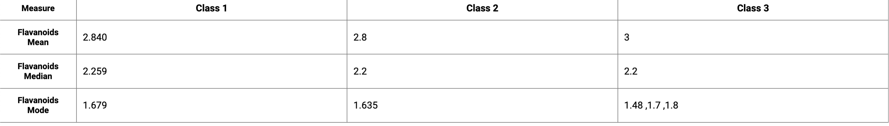
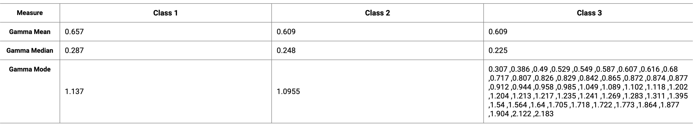

| Screenshot 1 - table showing Flavnoids data
|--------------|-----------|

| Screenshot 1 - table showing Gamma data
|--------------|-----------|

Kindly follow these steps to run this project

# manufac-assignment

In this project we have json, based on which we made utility functions to calculate the class-wise mean, median, mode of
“Flavanoids” and 'Gamma' for the entire dataset.

## Prerequisites

Before you begin, ensure you have met the following requirements:

- Node.js and Yarn installed on your machine.

## Getting Started

To get a local copy up and running, follow these simple example steps.

### Installation

1. Clone the repository

   git clone https://github.com/your-username/your-project.git

2. Change into the project directory
   cd your-project

3. yarn install

### Usage
yarn start

will open http://localhost:3000
where we can view our project

